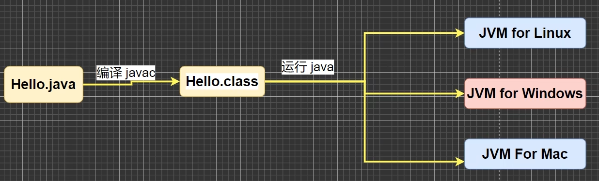
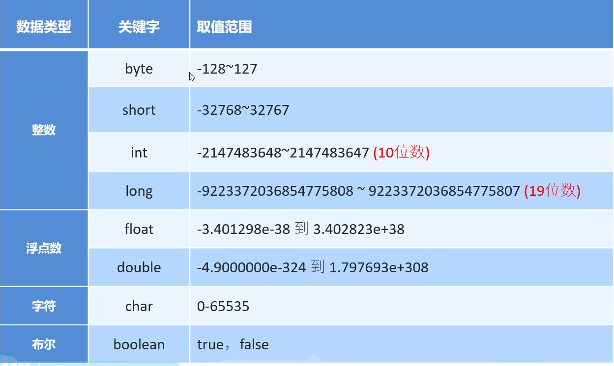
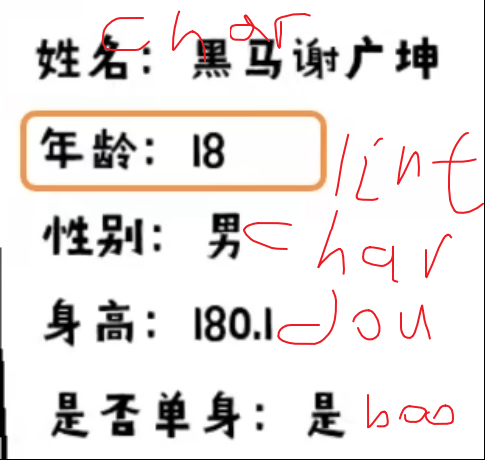

# Java

​

​

# java基础

## 注释

> 在程序指定位置添加的说明性信息

注释分类：单号、多行、文档注释

```java
单行注释    //我是单行注释
多行注释    /*我是多行注释*/
文档注释    /**我是文档注释**/
```

‍

## 关键字

> 被java赋予特定含义的英文单词
>
> 关键字全部小写

class：用于创建一个类，类是java最基本的组成单元

‍

## 字面量

> 数据在程序中的书写格式

字面量分类：整数类型、小数类型、字符串类型、字符类型、布尔类型、空类型

|字面量类型|说明|举例|
| ------------| ----------------------------------| ----------------------------|
|整数类型|不带小数点的数字|666， -88|
|小数类型|带小数点的数字|13.14， -5.21|
|字符串类型|用双引号括起来的内容|"HelloWorld"，"黑马程序员"|
|字符类型|用单引号括起来的，内容只能有一个|'A'，'0'，'我'|
|布尔类型|布尔值，表示真假|只有两个值：true，false|
|空类型|一个特殊的值，空值|值是：null|

‍

特殊字符：\t \r \n

> \t    制表符    再打印的时候，把前面字符的长度补齐到8，或者8的整数倍。最少1个空格，最多补

```java
public class Literalvalue {
    public static void main(String[] args) {
        System.out.println("name"+"\t"+"age");
        System.out.println("tom"+"\t"+"23");
    }
}
```

‍

## 变量

> 在程序的执行过程中，其值有可能发生改变的量(数据)

### 变量的定义

> 数据类型 变量名 = 数据值;
>
> ‍
>
> 数据类型为空间中存储的数据、加入类型
>
> 变量名是为空间起的名字
>
> 数据值是存在空间里的数值

```java
public class Variable {
    // 主入口
    public static void main(String[] args) {
        // 定义变量
        // 数据类型 变量名 = 数据值
        // 数据类型:限定了变量能存储数据的类型
        // int(整数) double(小数）
        //变量名:就是存储空间的名字
        //作用:方便以后使用
        //数据值:真正存在变量中的数据

        //等号:赋值

        int a = 10;
        System.out.println(a);
    }
}
```

‍

### 变量的使用方式

**输出打印**

```java
public class Variablemethod {
    public static void main(String[] args){
        int a = 10;
        System.out.println(a);
    }
}
```

**参与计算**

```java
public class Variablemethod {
    public static void main(String[] args){
        int a = 10;
        int b = 20;
        System.out.println(a+b); 
    }
}
```

**修改记录的值**

```java
public class Variablemethod {
    public static void main(String[] args){
        int a = 10;
        System.out.println(a);
        a = 20;
        System.out.println(a);
    }
}
```

‍

### 变量的注意事项

- 只能存在一个值
- 变量名不允许重复定义
- 一条语句可以定义多个变量
- 变量在使用之前一定要进行赋值
- 变量的作用域范围

```java
package java基础;

public class variabledemo2 {
    public static void main(String[] args) {
        // 注意事项
        //在一条语句中，可以定义多个变量
        int d = 100, e = 200, f = 300;
        System.out.println(d);
        System.out.println(e);
        System.out.println(f);

        // 变量再使用之前必须要赋值
        int g;
        // g = 500;
        System.out.println(g);    // 报错 java: 可能尚未初始化变量g
    }
}

```

‍

### 练习

```java
public class variabletest {
    public static void main(String[] args) {
        // 一开始没有乘客
        int count = 0;
        // 第一站: 上去一位乘客
        count = count + 1;
        // 第二站: 上去两位乘客，下来一位乘客
        count = (count + 2) - 1;
        // 第三站: 上去两位乘客，下来一位乘客
        count = (count+2) - 1;
        // 第四站: 下来一位乘客
        count = count - 1;
        // 第五站: 上去一位乘客
        count = count + 1;
        // 请问: 到了终点站，车上一共几位乘客
        System.out.println(count);
    }
}
```

‍

‍

## 数据类型

### 基本数据类型

​

```java
public class variabledemo3 {
    // 主入口
    public static void main(String[] args) {
        // byte
        byte b = 10;
        System.out.println(b);
        // short
        short s = 20;
        System.out.println(s);
        // int
        int i = 30;
        System.out.println(i);
        // long
        // 如果要定义long类型的变量
        // 在数据值的后面需要加一个L作为后缀
        // L可以大写的，也可以使用小写的
        // 建议使用大写
        long l = 9999999999L;
        System.out.println(l);


        // float
        // 注意点:定义float类型变量的时候
        // 数据值也需要加一个F作为后缀
        float f = 10.1F;
        System.out.println(f);

        // double
        double d = 20.2;
        System.out.println(d);

        // char
        char c = '中';
        System.out.println(c);

        // boolean
        // true & false
        boolean o = true;
        System.out.println(o);

    }
}

```

其中float、long需要加后缀F、L

整数和小数取值范围大小关系

> double > float > long > int > short > byte

#### 练习



```java
package java基础;

public class variabletest2 {
    // 主入口
    public static void main(String[] args){
        String name = "Eecho";
        int age = 18;
        char gender = '男';
        double height = 180.1;
        boolean flag = true;
        System.out.println("姓名："+name+'\n'+"年龄："+age+'\n'+"性别："+gender+'\n'+"身高："+height+'\n'+"是否单身："+flag);

    }
}
```

‍

### 引用数据类型

‍

## 标识符

命名规范：数字、字母、下划线、$组成

不能以数字开头，不能是关键字、区分大小写

**小驼峰命名法**：标识符是一个单词的时候，全部小写，多个单词第一个单词首字母小写其它大写

**大驼峰命名法**：标识符是一个单词的时候，首字母大写。多个单词组成的时候，每个单词的首字母大写

‍

## 键盘录入

Scanner这个类可以接收键盘输入的数字

1. 导包 ---- Scanner这个类在哪

    1. ```java
        import java.util.Scanner
        ```
2. 创建对象 ---- 表示要开始用Scanner这个类了

    1. ```java
        Scanner sc = new Scanner(System.in);
        ```
3. 接收数据 ---- 真正开始干活

    1. ```java
        int i = sc.nextInt();
        ```

### 练习

​

```java
import java.util.Scanner;

public class scannertest {
    public static void main(String[] args) {
        Scanner sc1 = new Scanner(System.in);
        System.out.println("请输入第一个数字:");
        int num1 = sc1.nextInt();
        System.out.println("请输入第二个数字:");
        int num2 = sc1.nextInt();
        System.out.println(num1 + num2);
    }
}
```

‍

‍

## 运算符

### 运算符和表达式

运算符：对字面量或者变量进行操作的符号

表达式：用运算符把字面量或者变量连接起来，符合java语法的式子就可以称为表达式。

> int a = 10;
>
> int b = 20;
>
> int c = a + b
>
> +是运算符
>
> a+b是表达式

‍

### 算术运算符

```java
+ - * / %
```

```java
public class demo1 {
    public static void main(String[] args) {
        // +
        System.out.println(3 + 2);
        // -
        System.out.println(5 - 1);
        // * 乘
        System.out.println(5 * 2);
        // / 除
        System.out.println(5 / 2);
        // % 模除
        System.out.println(5 % 2);

        // 如果计算的时候有小数参与
        // 在代码中，如果有小数参与计算，结果有可能不精确的
        System.out.println(1.1 + 1.01);
        System.out.println(1.1 - 1.01);
    }
}

```

‍

#### 类型转换的分类

##### 隐式转换(自动类型提升)

取值范围小的数值 --> 取值范围大的数值

把一个取值范围小的数值，转换成取值范围大的数据

```java
int a = 10;
double b = a;
// 10.0
```

取值范围：byte < short int long float double

什么时候转换：数据类型不一样，不能进行计算，需要转换成一样的才可以进行计算

转换规则1：取值范围小，和取值范围大的进行计算，小的会先提升为大的，再进行运算

转换规则2：byte short char三种类型的数据在运算的时候，都会直接提升为int

‍

‍

##### 强制转换

取值范围大的数值 --> 取值范围小的数值

‍
